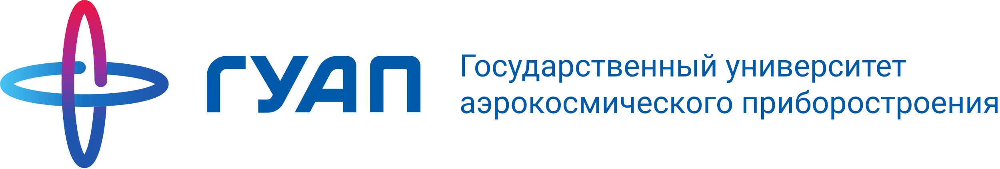
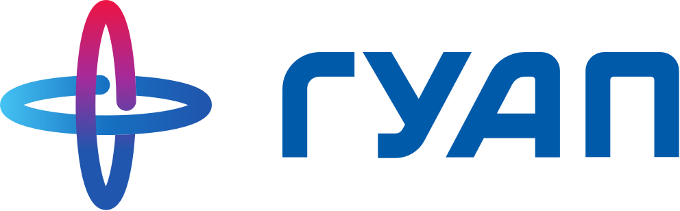

<!-- _class: lead -->
<!-- _paginate: false -->

# ЗАНЯТИЕ 3

## Разбор практики 1: сложности, с которыми вы встретились

19 сентября 2026 · конспект занятия — `Zanyatie_03_Lekciya_Konspekt.docx`

<!-- Начать спокойно: «На прошлой паре вы встретились со сложностями. Сегодня их разбираем, дома — ещё один подход». -->

---

До фиксации темы — 7 дней · до чекпоинта 21.11 — 9 недель · до защиты 26.12 — 14 недель

26.09

Тема зафиксирована

Вторая версия листов, паспорт, представление

10 баллов

24.10

План собран

WBS, Ганта, смета, риски

10 баллов

21.11

Чекпоинт

Промежуточный результат

10 баллов

26.12

Питч-защита

Результат, отчёт, защита

50 баллов

Плюс два зачётных теста по 10 баллов: 10.10 — «Инициация», 28.11 — «Планирование и контроль».  Итого 100 баллов за семестр

---

ЗАМЫСЕЛ · УЧЕБНЫЙ ВОПРОС 1

# Вы встретились со сложностями — так и было задумано

12 сентября вы получили листы и задание, но ни одного определения. Почти в каждой команде какие-то строки вызвали спор или остались пустыми.

Продуктивное затруднение (productive failure) — приём, при котором задача даётся до инструктажа. Последующее объяснение усваивается глубже: вы уже знаете на своём опыте, где тонко, и слушаете ответ на свой вопрос.

*Источник: M. Kapur, «Productive Failure», Cognition and Instruction, 2008.*

---

УЧЕБНЫЙ ВОПРОС 1

# Пять сложностей — они же план занятия

| № | Где было сложно | Разбираем |
|---|---|---|
| 1 | «Для кого» — трудно было сузить | вопрос 3 |
| 2 | «В отличие от чего» — казалось, аналогов нет | вопрос 3 |
| 3 | «Выгода» — нечем измерить | вопрос 3 |
| 4 | Буквы M и T — откуда число и дата | вопрос 4 |
| 5 | Зачем всё это, если идея и так ясна | вопросы 3–4 |

Плюс вопрос 2 — карта процесса, вопрос 5 — масштаб и отказ от идеи, вопрос 6 — что делать дальше.

---

УЧЕБНЫЙ ВОПРОС 2

# Фаза инициации: восемь шагов

*Модель PMBOK Guide (Project Management Institute). На практике 1 вы выполняли шаги 1–5.*

| № | Шаг | Где вы |
|---|---|---|
| 1–2 | Проблема, генерация двух альтернатив | сделано |
| 3 | Отбор по критериям | сделано |
| 4 | Ценностное предложение | **сложности 1–3** |
| 5 | Цель по SMART | **сложность 4** |
| 6–7 | Стейкхолдеры, паспорт проекта | 26.09 / сегодня |
| 8 | Решение go/no-go | 26.09 |

---

УЧЕБНЫЙ ВОПРОС 2

# Почему требовалось два концепта

Шаг 2 предписывает не менее двух альтернатив: сначала дивергенция — расширение поля, затем конвергенция — сужение по критериям.

Если второй концепт появился уже после того, как решение сложилось, дивергенции не было: критерии применяются задним числом к выбранному варианту.

Смысл процедуры — возможность обосновать выбор перед третьим лицом, а не сослаться на своё предпочтение.

---

УЧЕБНЫЙ ВОПРОС 3 · ОПРЕДЕЛЕНИЕ

# Ценностное предложение

Ценностное предложение (value proposition) — проверяемое утверждение о том, какую конкретную выгоду и для какой конкретно очерченной группы создаёт результат проекта, и чем предлагаемый способ превосходит тот, которым задача решается в его отсутствие.

*Источник: А. Остервальдер, И. Пинье, «Business Model Generation» (2010); «Value Proposition Design» (2014).*

---

УЧЕБНЫЙ ВОПРОС 3 · СЛОЖНОСТЬ 1

# Почему сузить адресата было сложно

«Для студентов» — не невнимательность. Автор идёт от своего опыта, а свой опыт не ощущается как частный: знакомая мне проблема кажется общей.

Критерий достаточной конкретности: группу можно физически найти и опросить. «Студентов» опросить нельзя. «Первокурсников перед первой сессией» — можно.

---

УЧЕБНЫЙ ВОПРОС 3 · СЛОЖНОСТЬ 2

# Почему казалось, что альтернативы нет

Искали другой проект или конкурирующую разработку — и не находили.

Альтернатива — это любой способ, которым носитель проблемы справляется сейчас, включая заведомо плохой: делает вручную, откладывает, мирится, спрашивает у знакомых.

**Такой способ есть всегда: проблема существует уже сейчас, а проекта ещё нет.**

---

УЧЕБНЫЙ ВОПРОС 3 · СЛОЖНОСТЬ 3

# Почему выгоду было сложно измерить

«Станет удобнее» появляется, когда выгоду называют раньше адресата и альтернативы.

Выгода по своей природе — разность: между состоянием адресата при текущем способе и при предлагаемом. Пока не определены оба, разности нет, остаётся оценочное слово.

**Отсюда порядок заполнения: адресат → альтернатива → предмет → выгода.**

---

УЧЕБНЫЙ ВОПРОС 3 · СЛОЖНОСТЬ 5

# Зачем вообще этот инструмент

- **Фильтр** — отсекает идею без адресата до того, как на неё потрачен семестр
- **Соглашение внутри команды** — расхождения в понимании задачи обнаруживаются, пока согласование ничего не стоит
- **Ядро внешнего документа** — первый абзац грантовой заявки и первый тезис защиты

---

УЧЕБНЫЙ ВОПРОС 4 · ОПРЕДЕЛЕНИЕ

# Метод SMART

SMART — процедура проверки формулировки цели по пяти критериям: Specific, Measurable, Achievable, Relevant, Time-bound.

*Источник: G. T. Doran, «There's a S.M.A.R.T. way to write management's goals and objectives», Management Review, 1981.*

Нового содержания нет: S — это Scope, T — Time, A — ресурсное ограничение из вводной лекции.

---

УЧЕБНЫЙ ВОПРОС 4 · СЛОЖНОСТЬ 4

# Откуда берётся число (буква M)

Та же природа, что у сложности с выгодой: число нельзя назвать, пока не определено, что измеряется и относительно чего.

| Составляющая | Без неё |
|---|---|
| Измеряемая величина | нечего мерить |
| Единицы измерения | число бессмысленно |
| Способ получения значения | число произвольно |

Приблизительное число при названном способе измерения лучше отсутствия числа: первое уточняется, второе не проверяется никогда.

---

УЧЕБНЫЙ ВОПРОС 4 · СЛОЖНОСТЬ 4

# Откуда берётся дата (буква T)

«В течение семестра» не задаёт момента, в который возможна проверка.

В этом курсе есть ровно две контрольные даты: <b>21 ноября</b> — чекпоинт, предъявление промежуточного результата, и <b>26 декабря</b> — защита. Цель распределяется между ними.

---

УЧЕБНЫЙ ВОПРОС 4

# Почему пропускались A и R: три уровня

| Уровень | Что описывает | Пример |
|---|---|---|
| Цель продукта | Изменение у пользователя | Растение не гибнет от полива |
| **Цель проекта** | Что предъявим и к какой дате | Прототип ±10 %, к 26.12 |
| Задача | Шаг внутри работы | Закупить датчик |

SMART применяется на среднем уровне. На уровне продукта не проверяется A: изменение у пользователя команда не контролирует. На уровне задачи не проверяется R: отдельное действие не соотносится с проблемой.

Тест: если формулировку можно выполнить и при этом не получить ничего, что можно предъявить, — это задача. «Изучить литературу», «провести эксперименты».

---

УЧЕБНЫЙ ВОПРОС 5

# Масштаб проекта и отказ от идеи

**Масштаб.** Слишком крупный — нечего предъявить к 21.11. Слишком мелкий — на защите нечего обсуждать. Проверка: есть ли промежуточный результат, который можно показать отдельно и который сам по себе что-то значит. Ориентир при нагрузке в 5–6 дисциплин: порядка 13 учебных недель по одной паре.

Эскалация обязательств (escalation of commitment) — чем больший ресурс уже вложен в выбранный вариант, тем выше субъективная стоимость отказа от него, независимо от объективной перспективности. Возрастает не трудоёмкость переделки, а сопротивление самому решению.

---

<!-- _class: dark -->

УЧЕБНЫЙ ВОПРОС 6

# Тему ещё можно поменять

<b>До 26 сентября включительно</b> Замена темы целиком — без обоснования причины и без последствий для оценки.

<b>После 26 сентября</b> Паспорт подписан, тема зафиксирована. Дальше — только уточнение формулировок внутри темы.

---

УЧЕБНЫЙ ВОПРОС 6

# Ещё один подход, а не правка

Правка сохраняет исходную логику и сводится к замене слов. Чистый бланк позволяет построить рассуждение заново — уже с аппаратом.

**Лист 1:** адресат (можно найти и опросить?) → альтернатива (как справляются сейчас) → предмет → выгода как разность.

**Лист 2:** только уровень цели проекта. Для M — величина, единицы, способ измерения. Для T — распределение между 21.11 и 26.12.

---

РЕЗЮМЕ

# Что изменилось за эту пару

Неделю назад инструменты были формой, которую надо заполнить. Сейчас у каждой строки есть причина, по которой она там стоит.

Ни одна из пяти сложностей не про невнимательность: в основе каждой — отсутствие различения, которое сегодня введено. Поэтому второй подход к листам вам сейчас по силам, а неделю назад был не по силам.

---

ВОПРОСЫ ДЛЯ САМОКОНТРОЛЯ

# Проверьте себя

1. Почему задание было дано раньше объяснения? Как называется приём?
2. Восемь шагов инициации — к каким относились ваши сложности?
3. Почему выгода формулируется последней?
4. Почему «аналогов нет» почти всегда неверно?
5. Цель продукта, цель проекта, задача — в чём различие?
6. Тест, отличающий цель от задачи.

---

ЗАДАНИЕ К 26 СЕНТЯБРЯ

# Ещё один подход: оба листа с чистого бланка

1. **Лист 1 и лист 2 заново** — по порядку с предыдущего слайда
2. **Представление проекта** — 3 минуты устно, включая минуту о том, что пока не сходится
3. **Решение по теме** — сохраняете или меняете. После 26.09 замена невозможна

Первые листы не выбрасывайте — принесите оба: сравнение и есть самое интересное.
