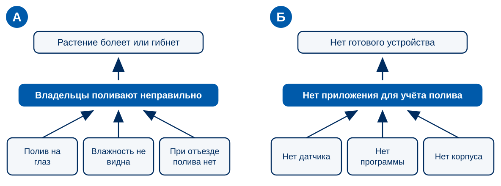
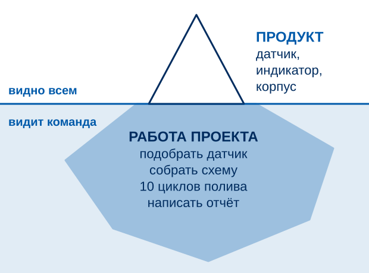
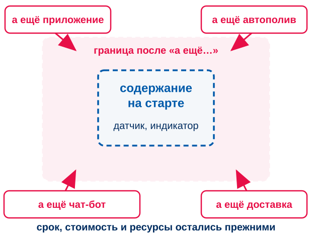
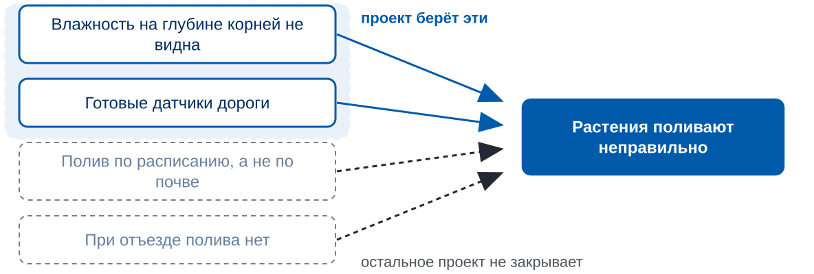
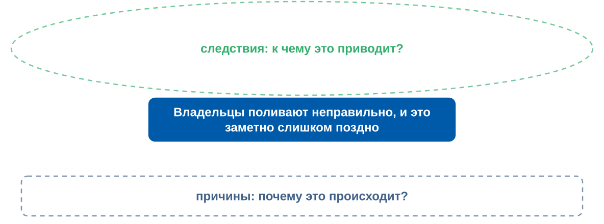
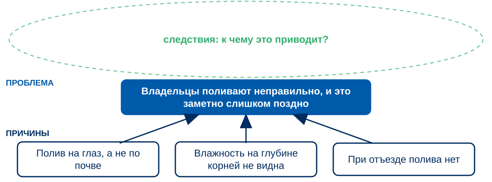
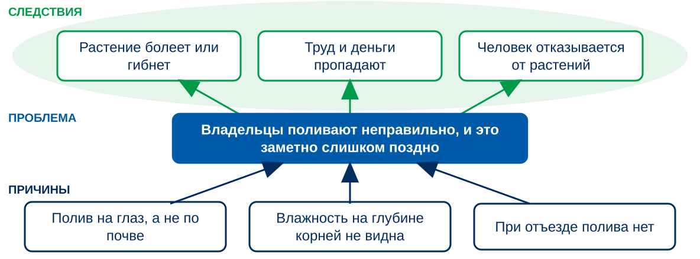
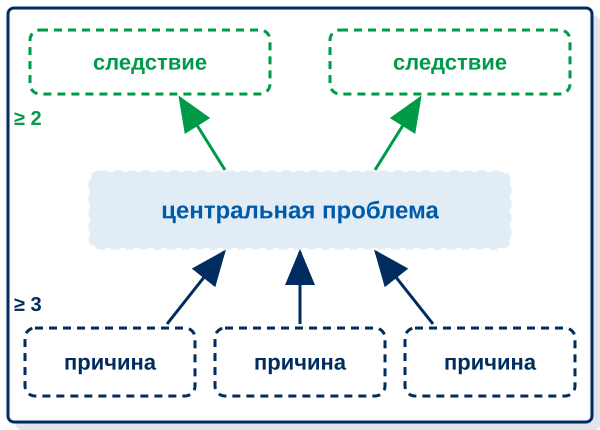
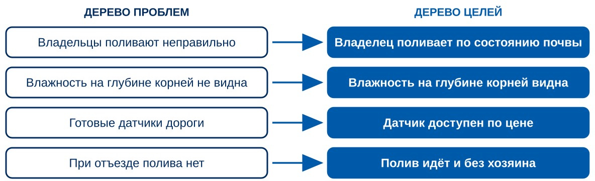
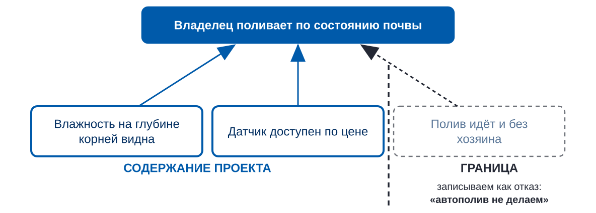

<!-- _class: lead -->
<!-- _paginate: false -->

# ЗАНЯТИЕ 5 · НАЧАЛО ПЛАНИРОВАНИЯ

## Содержание проекта: что мы делаем и чего не делаем

*К концу пары у команды на листе А4 дерево проблем и дерево целей, а границы проекта записаны как ветви, которые вы оставляете*

3 октября 2026

---

До плана — 3 недели · до чекпоинта — 7 недель · до защиты — 12 недель

26.09 · 03.10

Тема зафиксирована

Сегодня сдаём паспорт начисто

10 баллов

24.10

План собран

WBS, Ганта, смета, риски

10 баллов

21.11

Чекпоинт

Промежуточный результат

10 баллов

26.12

Питч-защита

Результат, отчёт, защита

50 баллов

Два зачётных теста по 10 баллов: 10.10 «Инициация», 28.11 «Планирование и контроль». Итого 100 баллов

<b>85–100</b>отлично

<b>70–84</b>хорошо

<b>55–69</b>удовлетворительно

<b>менее 55</b>не зачтено

Порог зачёта — 55 баллов. Всё, кроме защиты, даёт ровно 50: без защиты зачёта нет

---

# Сегодня — четыре вопроса о содержании проекта

| № | Вопрос | Мин |
|---|---|---|
| — | Представления проектов, сдача паспортов начисто | 20 |
| — | Найдите ошибку: два дерева | 5 |
| 1 | Что такое содержание проекта и зачем его записывать | 8 |
| 2 | Почему из проблемы нельзя сразу выводить задачи | 7 |
| 3 | Дерево проблем: как найти причины и следствия | 22 |
| 4 | Дерево целей: от причин к содержанию проекта и его границам | 23 |
| — | Домашнее задание | 5 |

---

<!-- _class: v2 dark hook -->

# Одно из двух деревьев — дерево проблем. Какое?

■ СТОП · 30 секунд — голосуем: А или Б

---

# «Нет приложения» — не проблема, а решение, записанное наоборот

<table class="contour">
<tr><th class="w45">Как прозвучало в представлениях</th><th>Как записать, не называя свой продукт</th></tr>
<tr><td>например: нет приложения для учёта полива</td><td>например: владельцы поливают на глаз, и перелив видно, когда растение уже пострадало</td></tr>
<tr><td></td><td></td></tr>
<tr><td></td><td></td></tr>
</table>

Рабочая форма: у кого, что происходит, и это приводит к чему. Если фразу нельзя произнести без слов о вашем продукте, это решение.

---

# Содержание проекта — работа, которую нужно выполнить, чтобы получить результат

Содержание проекта (project scope) — работа, необходимая для получения продукта, услуги или результата с заданными характеристиками.

PMBOK Guide, PMI

<b>Продукт</b> — что получится. <b>Содержание проекта</b> — что для этого придётся сделать.

---

# Незаписанное содержание растёт само

Каждый участник и каждый слушатель защиты добавляет «а ещё было бы хорошо».

Рост без пересмотра срока, стоимости и ресурсов называется <b>расползанием содержания</b> (scope creep).

Защита от него — записанные границы. В паспорте они уже есть.

---

# Из проблемы нельзя сразу выводить задачи: у неё несколько причин

Проект берёт только часть причин. Чтобы выбрать честно, причины нужно сначала увидеть.

---

# Дерево проблем строится вокруг одной центральной проблемы

Дерево проблем — схема причинно-следственных связей вокруг одной проблемы.

Рабочая программа дисциплины, тема «Принципы построения дерева проблем и дерева целей»

---

# Причины записываются ниже: почему это происходит?

Идём вниз, пока не дойдём до того, что команда может изменить.

---

# Следствия — выше: к чему это приводит?

Прочитайте каждую связь вслух: «А приводит к Б». Это факт или догадка?

---

# Если запись начинается с глагола действия, это решение, а не причина

| Это решение | Это причина |
|---|---|
| установить датчик | влажность на глубине корней не видна |
| сделать приложение | владелец не знает, когда пора поливать |
| купить автополив | готовые устройства дороги и рассчитаны на теплицу |

Дерево отвечает на вопрос «почему». Вопрос «что делать» наступит на следующем шаге.

---

# Постройте дерево проблем своего проекта на листе А4

<ol>
<li>Проблема — в середине листа</li>
<li>Причины ниже, не меньше трёх</li>
<li>Следствия выше, не меньше двух</li>
</ol>

Вопрос при обходе: можно ли записать проблему, не называя ваш продукт?

■ СТОП · 12 МИНУТ — дерево проблем на листе А4

---

# Дерево целей — то же дерево, записанное как желаемое состояние

Дерево целей — иерархия целей, полученная из дерева проблем: каждая проблема переписывается в состояние, при котором её нет.

Рабочая программа дисциплины, тема «Принципы построения дерева проблем и дерева целей»

---

# Содержание проекта — выбранные ветви дерева целей, границы — оставленные

Выбор идёт по проверкам цели SMART: измеримо, осуществимо за срок, толково относительно проблемы.

---

# Инвертируйте дерево, отметьте, что берёте, и обменяйтесь листами

<b>10 мин</b>Перепишите каждый блок дерева проблем как желаемое состояние

<b>отметка</b>Ветви, которые берёте, и ветви, которые оставляете границей

<b>6 мин</b>Соседняя команда проверяет и отвечает на два вопроса

1. Есть ли для каждой цели причина в дереве проблем?
2. Помещается ли выбранное в срок до защиты?

■ СТОП · 16 МИНУТ — дерево целей, выбор ветвей, обмен листами

---

# К следующей паре — три разговора с теми, для кого вы делаете проект

- Выясните: **узнаёт ли человек свою ситуацию** в вашем дереве и **есть ли причина**, которой на листе нет
- Запишите **три цитаты дословно**. Лист А4 берёте с собой
